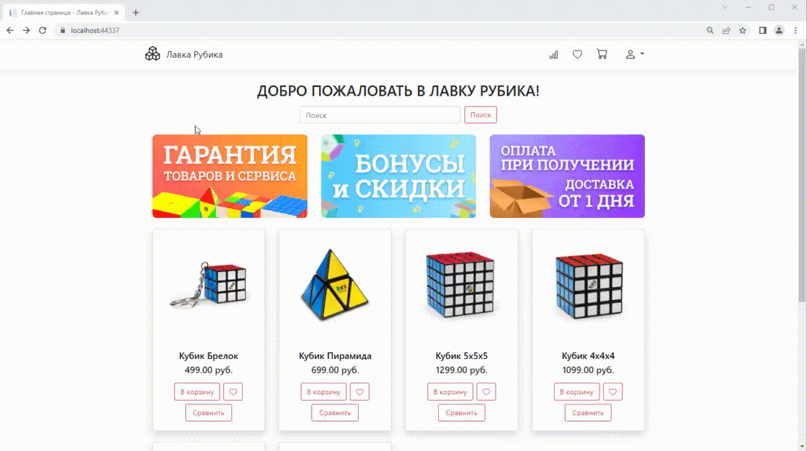
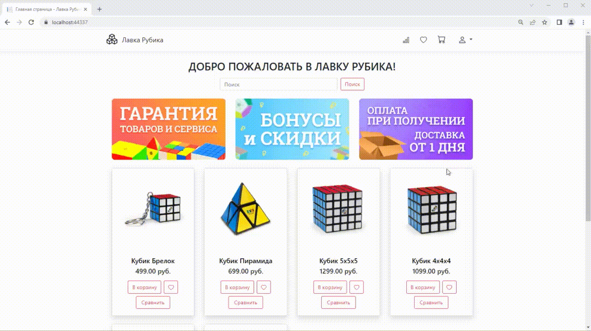

# OnlineShopWebApp
Данный проект создан в процессе изучения платформы ASP.NET Core.  
**Не для коммерческеского использования.**

## Архитектура приложения
Приложение разбито на части, в зависимости от выполняемых задач:
- слой пользовательского интерфейса и логики;
- слой работы с данными;
- слой работы с API;
- слой работы с тестами;
- микросервисное приложение для работы с комментариями и оценками к продуктам.

## Используемые технологии
Проект создан на ASP.Net Core v5.0.  
Для хранения данных используется Microsoft SQL Server 2022.  
Для работы с базой данных используются Entity Framework Core v5.  
Для работы с аутентификацией и авторизацией используется ASP.NET Core Identity v5.  
Для адаптивной верстки страниц используется Bootstrap v4.3.1.  

**Для просмотра карточки продукта необходимо запустить проект в репозитории RewviewsWebApplication для отображения комментариев.**

## Возможности приложения и примеры работы
### Главная страница  

### Просмотр карточки продукта
Для просмотра карточки продукта нужно нажать на название необходимого продукта. Для возврата на главную страницу необходимо нажать на кнопку "продолжить покупки" или на логотип "Лавка Рубика".  

### Поиск

### Регистрация и авторизация
Чтобы воспользоваться личным кабинетом, а также совершать покупки необходимо зарегистрироваться или авторизоваться в системе. Для этого нажмите на значок рядом с корзиной в верхнем правом углу.  

### Добавление в корзину и оформление заказа.
Добавить товар в корзину можно с главной страницы или из карточки товара.
В корзине доступно:
- очистка корзины;
- увеличение/уменьшение количества одной позиции;
- переход к оформлению заказа.
Для оформления заказа необходимо заполнить данные получателя и нажать кнопку "оформить заказ". Поле "комментарий к заказу" является опциональным.

### Личный кабинет пользователя
Возможности:
- добавление/изменение личных данных;
- изменение пароля;
- просмотр данных и статусов по всем заказам пользователя;
- доступ к корзине из личного кабинета.

### Панель администратора
Для того чтобы войти как администратор, в поле "логин" и "пароль" введите следующие данные:
- логин: admin@gmail.com
- пароль: _Aa123456

Возможности:
- просмотр всех заказов и изменение их статусов;
- редактирование данных пользователей (назаначение прав, смена пароля и данных, удаление).
- добавление/удаление ролей (администратор, модератор и т.д.);
- работа с товарами (добавление/редактирование/удаление).

